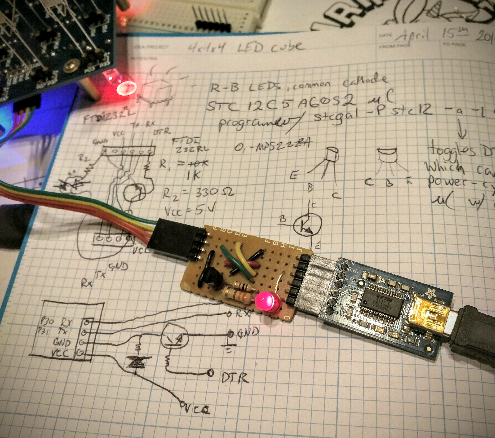

# HackerBox 005: STC12C5A60S2 4x4x4 LED cube

Source code and project information for [this LED cube kit](http://www.icstation.com/lightsquared-4x4x4-257mm-cube-white-redblu-p-4682.html) included in HackerBox 005.

# Links

* [HackerBoxes 005 instructables Step 10: 4x4x4 LED Cube: Microcontroller and Source Code](http://www.instructables.com/id/HackerBoxes-0005-LED-Pixels-2D-Matrix-4x4x4-Cube-a/step10/4x4x4-LED-Cube-Microcontroller-and-Source-Code/)
* [STC12C5A60S2 datasheet](http://www.stcmcu.com/datasheet/stc/stc-ad-pdf/stc12c5a60s2-english.pdf)
* [4681.zip - Original Chinese source code package](http://www.icstation.com/ebay/IC/All%20data%20modules/4681.zip)
* Similar project: https://github.com/tomazas/ledcube8x8x8

# Compiling and flashing

Your system needs these packages:

* [stcgal](https://github.com/grigorig/stcgal)
* [sdcc](http://sdcc.sourceforge.net/)

Many thanks to their respective authors, and to @grigorig for helping me understand
how to [get flashing working with auto-reset support](https://github.com/grigorig/stcgal/issues/12).

## Auto-reset when programming

Here's a [picture of the janky adapter board](img/ftdi-adapter-dtr-switch.jpg) I made to allow `stcgal -a`
to cut and restore power to the uC so programming repeatedly is easier.

